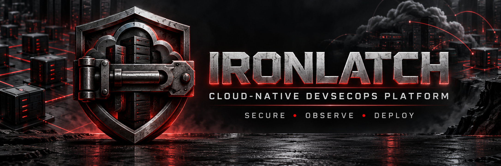
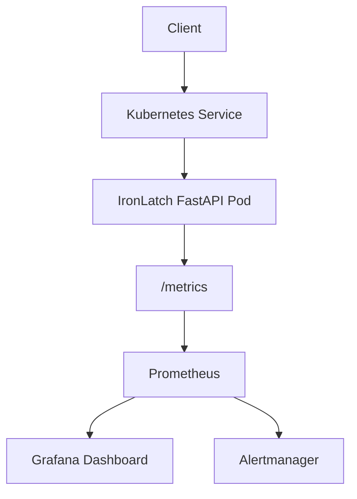

IronLatch is a cloud-native DevSecOps portfolio project that demonstrates secure application delivery, Kubernetes deployment, automated testing, observability, and alerting.

## Current Version

`1.1.0`

## Architecture



## Features

- FastAPI application with health, information, and deployment endpoints
- Prometheus-compatible `/metrics` endpoint
- Automated pytest coverage
- Docker container running as a non-root user
- Kubernetes Deployment and ClusterIP Service
- Readiness and liveness probes
- CPU and memory requests and limits
- Dropped Linux capabilities
- Read-only container filesystem
- Runtime-default seccomp profile
- Prometheus ServiceMonitor
- PrometheusRule alerts
- Grafana dashboard stored as code
- Kubernetes dashboard provisioning with Kustomize

## API Endpoints

| Method | Endpoint | Purpose |
|---|---|---|
| GET | `/health` | Kubernetes and application health check |
| GET | `/api/info` | Application name and version |
| POST | `/deployments` | Submit deployment metadata |
| GET | `/metrics` | Prometheus application metrics |

## Run Locally

```powershell
python -m venv .venv
.\.venv\Scripts\Activate.ps1
python -m pip install -r requirements.txt
uvicorn app.main:app --reload
```

Open:

- API documentation: `http://localhost:8000/docs`
- Health endpoint: `http://localhost:8000/health`
- Prometheus metrics: `http://localhost:8000/metrics`

## Run Tests

```powershell
python -m pytest -v
```

## Build the Container

```powershell
docker build -t ironlatch:1.1.0 .
docker run --rm -p 8000:8000 ironlatch:1.1.0
```

## Deploy to Kubernetes

```powershell
kubectl apply -f k8s/deployment.yaml
kubectl apply -f k8s/service.yaml
kubectl apply -f k8s/servicemonitor.yaml
kubectl apply -f k8s/prometheusrule.yaml
kubectl apply -k grafana
```

## Monitoring

The custom Grafana dashboard displays:

- Total API requests
- Live request rate
- HTTP error percentage
- P95 response latency
- Available Kubernetes replicas
- CPU utilization
- Memory utilization

Prometheus alerts detect:

- IronLatch becoming unavailable
- Error rate remaining above 5%

## Security Controls

IronLatch uses defense-in-depth controls across the container and Kubernetes layers:

- Non-root UID and GID
- Privilege escalation disabled
- All unnecessary Linux capabilities dropped
- Read-only root filesystem
- Runtime-default seccomp profile
- Explicit CPU and memory limits
- Health-based readiness and liveness checks

## Roadmap

- GitHub Actions CI/CD
- Dependency and container vulnerability scanning
- Software bill of materials and image signing
- Terraform infrastructure
- Cloud deployment and IAM
- Secrets management
- Centralized logging
- MLOps and AI infrastructure security