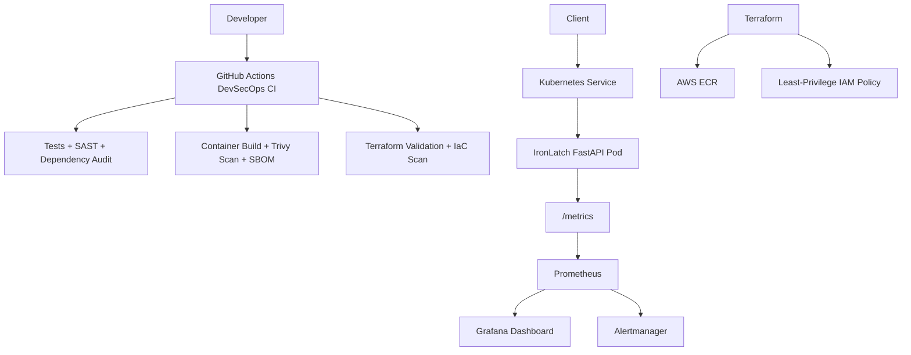

IronLatch is a cloud-native DevSecOps portfolio project demonstrating secure application delivery, automated security testing, container hardening, Kubernetes deployment, infrastructure as code, and observability.

## Architecture



## DevSecOps Pipeline

GitHub Actions automatically performs:

* Python dependency installation
* Pytest execution
* Bandit static application security testing
* Python dependency vulnerability auditing
* Docker image builds
* Trivy container vulnerability scanning
* CycloneDX SBOM generation
* Terraform formatting checks
* Terraform initialization and validation
* Trivy infrastructure-as-code security scanning

The pipeline blocks builds containing HIGH or CRITICAL container or IaC vulnerabilities.

## Application

IronLatch uses FastAPI and exposes:

| Method | Endpoint       | Purpose                                 |
| ------ | -------------- | --------------------------------------- |
| GET    | `/health`      | Application and Kubernetes health check |
| GET    | `/api/info`    | Application information and version     |
| POST   | `/deployments` | Submit deployment metadata              |
| GET    | `/metrics`     | Prometheus-compatible metrics           |

## Container Security

The production Docker image includes:

* Python slim base image
* Non-root runtime user
* Minimal application files
* No pip or setuptools package managers in the runtime image
* Reduced runtime attack surface
* Automated vulnerability scanning
* CycloneDX SBOM generation

## Kubernetes Security

The Kubernetes deployment uses defense-in-depth controls including:

* Non-root UID and GID
* Service account token automount disabled
* Privilege escalation disabled
* All Linux capabilities dropped
* Read-only root filesystem
* RuntimeDefault seccomp profile
* Explicit CPU and memory requests and limits
* Readiness and liveness probes
* NetworkPolicy restricting inbound pod traffic

## Observability

IronLatch exposes Prometheus metrics and includes monitoring resources as code.

The Grafana dashboard displays:

* Total API requests
* Live request rate
* HTTP error percentage
* P95 response latency
* Available Kubernetes replicas
* CPU utilization
* Memory utilization

Prometheus alerts detect:

* IronLatch becoming unavailable
* Sustained HTTP error rates above 5%

## Infrastructure as Code

Terraform provisions the AWS container-registry layer used by the project.

Configured infrastructure includes:

* Amazon ECR repository
* Immutable image tags
* Image scanning on push
* AES256 repository encryption
* Least-privilege IAM policy for CI access
* Configurable AWS region and repository name
* Terraform outputs for repository and IAM resources

Terraform configuration is automatically validated and security-scanned in CI.

## Run Locally

```powershell
python -m venv .venv
.\.venv\Scripts\Activate.ps1
python -m pip install -r requirements.txt
uvicorn app.main:app --reload
```

Open:

* API documentation: `http://localhost:8000/docs`
* Health endpoint: `http://localhost:8000/health`
* Metrics endpoint: `http://localhost:8000/metrics`

## Run Tests

```powershell
pytest -q
```

## Build the Container

```powershell
docker build -t ironlatch .
docker run --rm -p 8000:8000 ironlatch
```

## Deploy to Kubernetes

```powershell
kubectl apply -f k8s/deployment.yaml
kubectl apply -f k8s/service.yaml
kubectl apply -f k8s/networkpolicy.yaml
kubectl apply -f k8s/servicemonitor.yaml
kubectl apply -f k8s/prometheusrule.yaml
kubectl apply -k grafana
```

## Project Purpose

IronLatch was built as a hands-on DevSecOps platform demonstrating how application development, CI security controls, container security, Kubernetes hardening, infrastructure as code, vulnerability management, and observability fit together in one delivery lifecycle.
